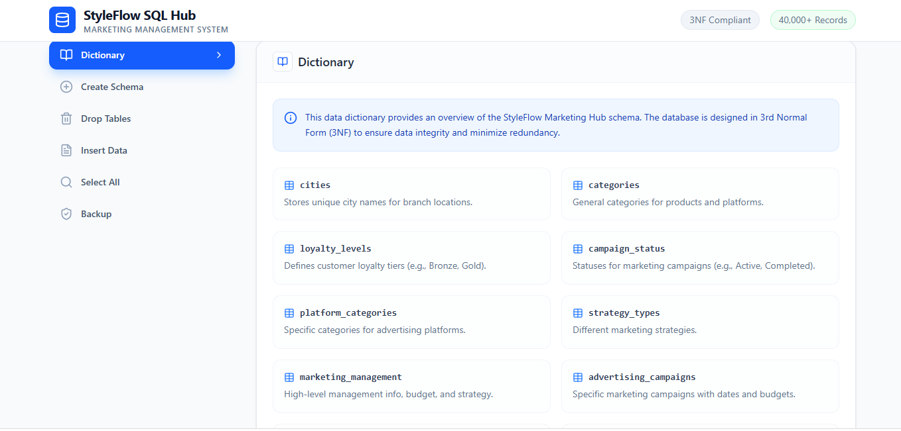
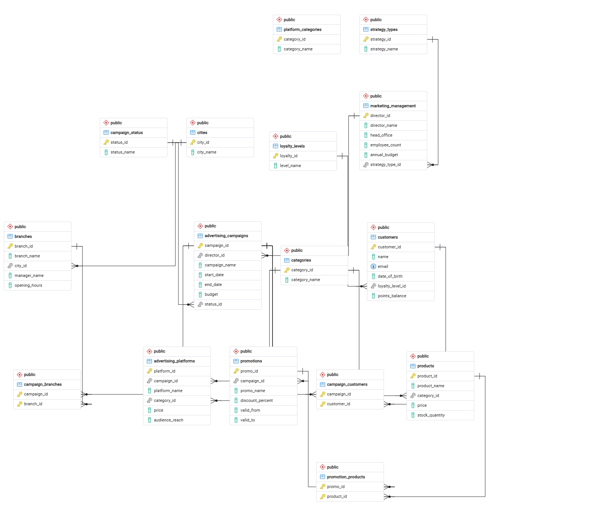
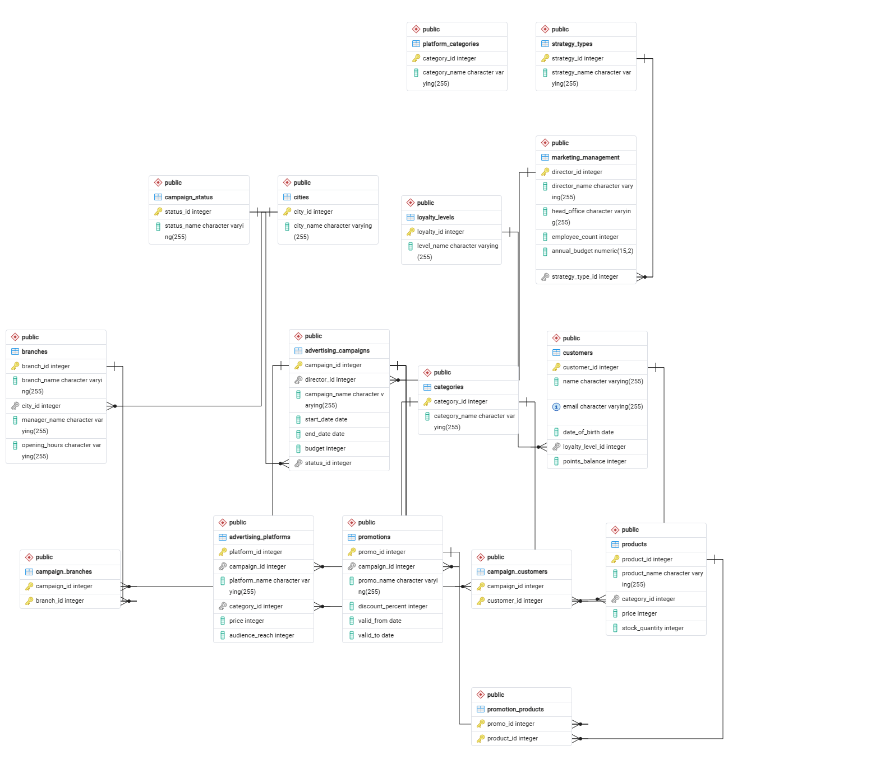
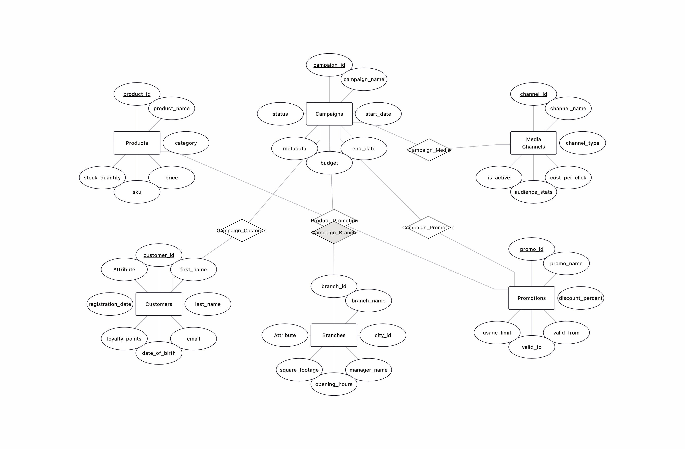
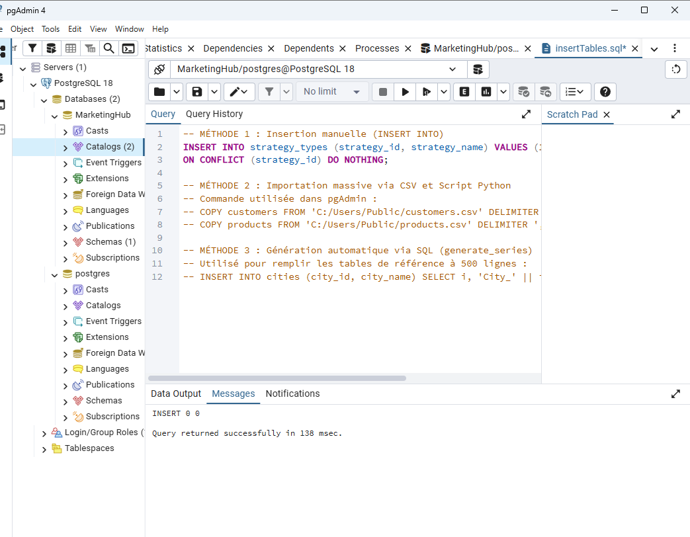
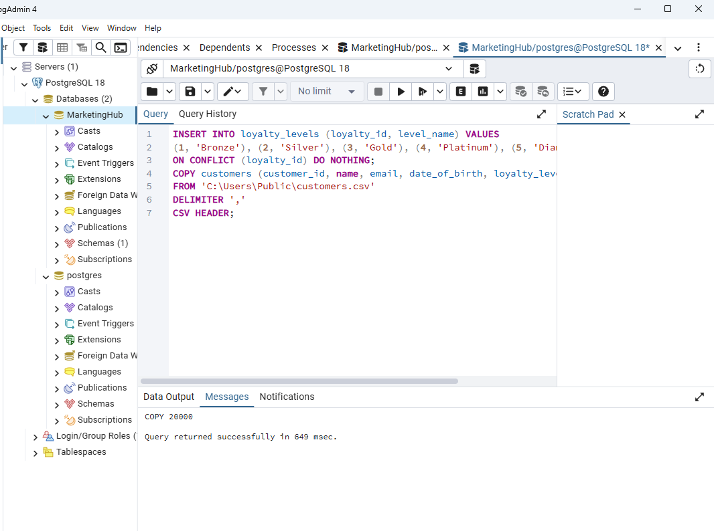
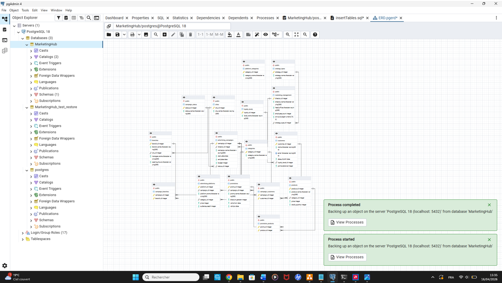

# Data-Base-Project  tirtsa wertenschlag 2023248  ariella bokobza 2075222

# דוח פרויקט: StyleFlow Marketing Hub - שלב א'

**מגישים:** אריאלה בוקובזה ותרצה ורטנשלג  
**תעודת זהות:** 2075222  - 2023248  
**יחידה:** DBProject (בניית בסיס נתונים)

---

## תוכן עניינים
1. [מבוא ותיאור המערכת](#1-מבוא-ותיאור-המערכת)
2. [מסכי המערכת ולינק (AI Studio)](#2-מסכי-המערכת-ולינק-ai-studio)
3. [תרשימי ERD ו-DSD](#3-תרשימי-erd-ו-dsd)
4. [שיטות הכנסת נתונים (צילומי מסך)](#4-שיטות-הכנסת-נתונים)
5. [גיבוי ושחזור נתונים (צילומי מסך)](#5-גיבוי-ושחזור-נתונים)
6. [רשימת קבצים בתיקייה](#6-רשימת-קבצים-בתיקייה)

---

## 1. מבוא ותיאור המערכת
מערכת **StyleFlow Marketing Hub** היא פלטפורמה לניהול שיווק של רשת אופנה גדולה. המערכת מרכזת נתוני לקוחות, נאמנות, ניהול קמפיינים וקישור מוצרים למבצעים.
**פונקציונליות עיקרית:** מעקב אחר תקציבי קמפיינים, ניהול פלטפורמות פרסום, והקצאת נקודות נאמנות ללקוחות. מטרת המודל היא ניהול מסודר של הקשר בין המוצרים, הלקוחות, הקמפיינים והמבצעים.

---

## 2. מסכי המערכת ולינק (AI Studio)
**קישור למערכת:** (https://ai.studio/apps/8650e2ea-a089-4a44-a7db-0bc43912f06a)

### מסכי המערכת:

---

## 3. תרשימי ERD ו-DSD
התרשימים משקפים את מבנה בסיס הנתונים בנרמול מלא (3NF).
* **ERD:** מציג את הקשרים הלוגיים בין הישויות.
* **DSD:** מציג את סוגי הנתונים (VARCHAR, INT, DATE) והמפתחות.

---

## 4. שיטות הכנסת נתונים (צילומי מסך)
השתמשנו ב-3 שיטות כנדרש בתיקיית `insertTables.sql`:

1. **שיטת התכנות (Python):** יצירת 20,000 רשומות ללקוחות ומוצרים.
  
2. **ייבוא קבצי CSV:** ייבוא מהיר באמצעות פקודת `COPY`.
  
3. **פקודות SQL:** שימוש ב-`generate_series` לאכלוס 500 ערים וקטגוריות.

---

## 5. גיבוי ושחזור נתונים (צילומי מסך)
ביצענו גיבוי מלא ושחזור בבסיס נתונים חדש. להלן הוכחת הצלחת השחזור עם 20,000 רשומות:

---

## 6. רשימת קבצים בתיקייה (Index)
בתיקיית המאגר תמצאו את הקבצים הבאים:
* `Characterization.md` - איפיון המערכת
* `createTables.sql` - יצירת הטבלאות
* `dropTables.sql` - מחיקת הטבלאות
* `insertTables.sql` - פקודות הכנסת נתונים
* `selectAll.sql` - שאילתות בדיקה
* `backup_2026_04_16.sql` - קובץ הגיבוי המעודכן
* תיקיות `DataImportFiles` ו-`Programing` עם קבצי המקור.
