# דוח פרויקט שלב ג - אינטגרציה ומבטים

**שם הפרויקט:** StyleFlow Marketing Hub (Integrated with Clothing Store System)

## 1. הינדוס לאחור (Reverse Engineering) - האגף שנתקבל (ERD 4)
האגף שהתקבל לביצוע אינטגרציה עוסק במערכת לניהול מלאי והזמנות מחסן של חנות בגדים (Clothing Store System).

### תרשים ה-ERD ששוחזר מהאגף שהתקבל (ERD 4):
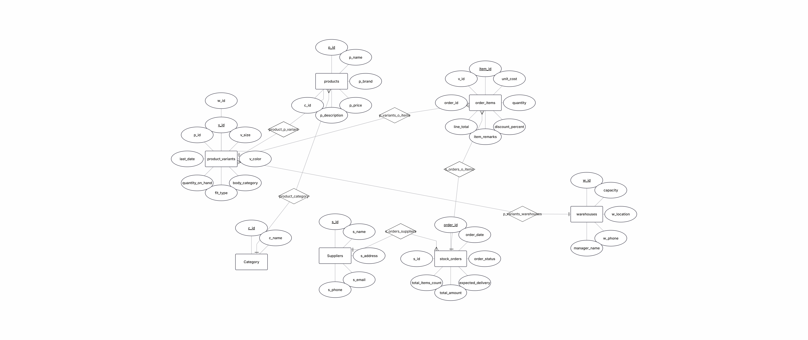

### רשימת הישויות שזוהו באגף שהתקבל (ERD 4):
1. **category (קטגוריה):** קטגוריות ראשיות של הבגדים (לדוגמה: בגדי גברים, בגדי נשים, קולקציית חורף וכד').
2. **products (מוצרים):** פרטי המוצר הגנריים (שם המוצר, מותג, מחיר בסיס, תיאור ומפתח קטגוריה).
3. **product_variants (וריאציות מוצר):** תתי-פריטים ספציפיים לפי מידה, צבע, כמות במלאי (quantity on hand), וכן קשרים למחסן ולמוצר האב.
4. **warehouses (מחסנים):** המיקומים הפיזיים של המלאי, כולל כושר אחסון, כתובת, טלפון ומנהל מחסן.
5. **suppliers (ספקים):** פרטי הספקים מהם רוכשים את הסחורה.
6. **stock_orders (הזמנות מלאי):** הזמנות מלאי המבוצעות מול הספקים, כולל תאריך, סטטוס, סכום כולל וכמות פריטים.
7. **order_items (פריטי הזמנה):** השורות המפרטות את כמויות ועלויות הוריאציות המוזמנות בכל הזמנת מלאי.

### מבנה הטבלאות שנתקבלו מהגיבוי (צילומי מסך מהמערכת):

* **שורות פריטי ההזמנות (Order Items Table):**
  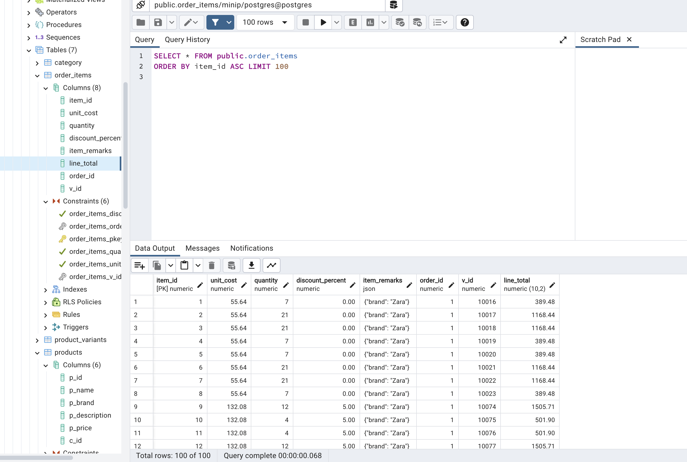

* **וריאציות ומאפייני מוצר (Product Variants Table):**
  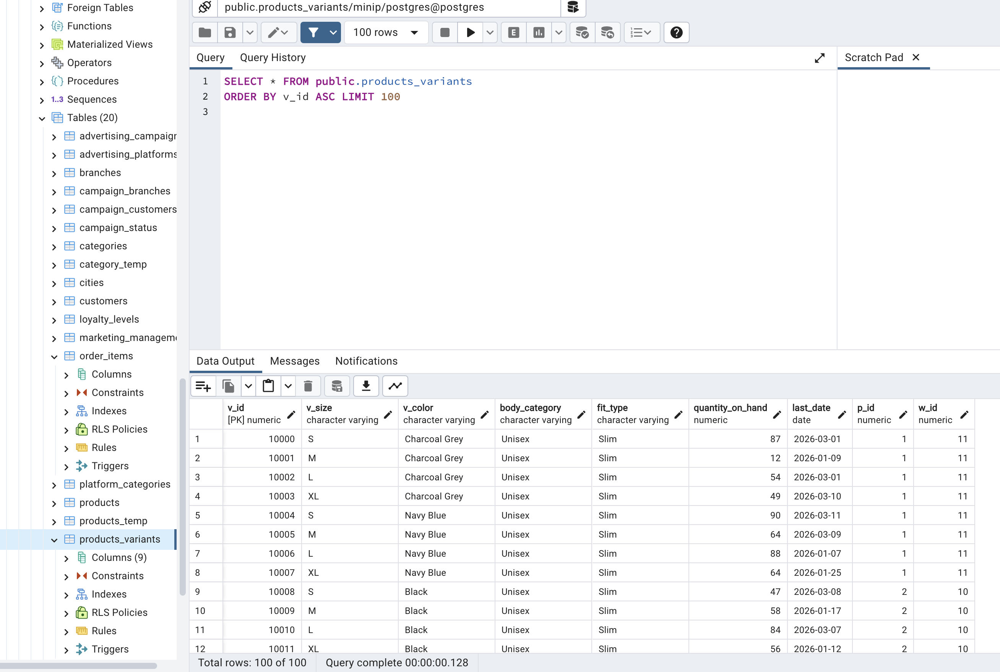

* **הזמנות ומצב מלאי מול ספקים (Stock Orders Table):**
  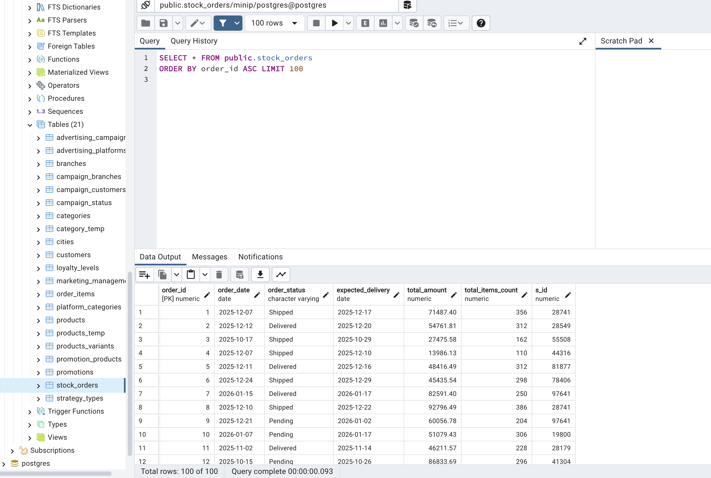

### אלגוריתם הינדוס לאחור (Reverse Engineering Algorithm):
כדי לקבל את בסיס הנתונים שקיבלנו (SQL Dump) ולהפיק ממנו את תרשים ה-ERD המתאים (ERD 4), פעלנו על פי האלגוריתם הבא:
1. **ניתוח משפטי CREATE TABLE:** סריקת קובץ ה-backup שקיבלנו ובידוד פקודות היצירה לישויות עצמאיות.
2. **איתור מפתחות ראשיים (PK):** זיהוי העמודות המסומנות כ-`PRIMARY KEY` או `NOT NULL` עם אילוצי מפתח ייחודיים (לדוגמה `c_id`, `p_id`, `v_id`) המשמשים כמזהים ייחודיים לכל ישות.
3. **זיהוי ומיפוי קשרים ומפתחות זרים (FK):**
   - איתור אילוצי `FOREIGN KEY` המגדירים קשרים בין הטבלאות.
   - מיפוי הקשר 1:N בין `category` ל-`products` (קטגוריה מכילה מוצרים רבים).
   - מיפוי הקשר 1:N בין `products` ל-`product_variants` (לכל מוצר יש מספר וריאציות של צבעים ומידות).
   - מיפוי הקשר 1:N בין `warehouses` ל-`product_variants` (מחסן מכיל וריאציות מוצרים רבות).
   - מיפוי הקשר 1:N בין `suppliers` ל-`stock_orders` (ספק מקבל הזמנות מלאי).
   - מיפוי הקשר 1:N בין `stock_orders` ל-`order_items` (הזמנה מורכבת מפריטים מוזמנים רבים).
   - מיפוי הקשר 1:N בין `product_variants` ל-`order_items` (וריאציה מוזמנת בשורות הפריטים של ההזמנות).
4. **ניתוח תכונות ואילוצים (Attributes & Constraints):** איתור אילוצי `CHECK` (לדוגמה טווח אחוז הנחה בין 0 ל-40, בדיקת פורמט אימייל של ספקים וכד').
5. **תרגום חזותי:** הזנת הישויות, התכונות והקשרים לתוך כלי השרטוט (ERDPlus) לקבלת תרשים ה-ERD המלא של האגף החדש.

---

## 2. תהליך האינטגרציה והחלטות הבנייה (מ-ERD 5 ל-ERD 3)

### תרשימי בסיס הפרויקט (מערכת המקור והמבנה הממוזג):

* **המערכת המקורית שלנו - Marketing Hub (ERD 5):**
  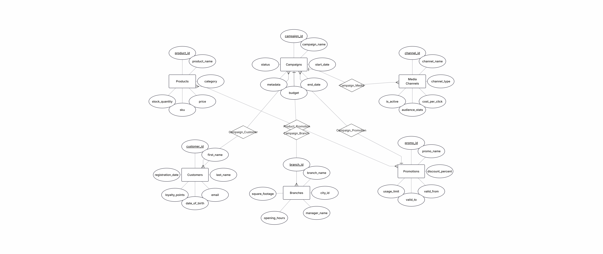

* **התרשים המשותף והממוזג הסופי (ERD 3):**
  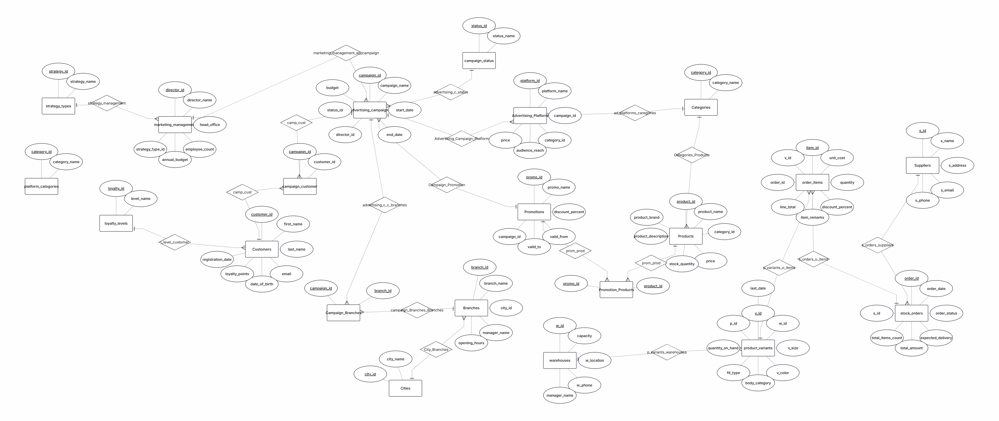

### תיאור שיטת האינטגרציה המעשית שביצענו (שלב ג'):
בניגוד למיזוג סכמות תאורטי בלבד, ביצענו את האינטגרציה במערכת הנתונים בפועל בצורה מדויקת ושלב-אחר-שלב, תוך שימור מלא של הנתונים והמאפיינים המקוריים של שני האגפים ובמיוחד עבור הישות המשותפת - **מוצרים (Products)**.

להלן תיאור מפורט של זרימת העבודה שיושמה בפועל:
1. **הרצה של קוד האגף שהתקבל:** הקמנו והרצנו על בסיס הנתונים הקיים שלנו את קוד יצירת הטבלאות שקיבלנו מהאגף השני (מערכת ניהול חנות בגדים).
2. **טיפול בטבלה המשותפת (Products - מוצרים):**
   שני האגפים החזיקו בטבלה המייצגת מוצרים, אך במבנים ותכונות שונים:
   - האגף המקורי שלנו (`erd5` - Marketing) כלל: `product_id`, `product_name`, `category`, `stock_quantity`, `price`, `sku`.
   - האגף שהתקבל (`erd4` - Clothing Store) כלל: `p_id`, `p_name`, `p_brand`, `p_description` (json), `p_price`, `c_id`.
   
   כדי לבצע את המיזוג בצורה הבטוחה ביותר מבלי לפגוע בנתונים קיימים וליישר קו בין שתי המערכות, ביצענו את השלבים הבאים:
   - **יצירת טבלה זמנית (Temp Table):** הקמנו במערכת טבלה זמנית בשם `temp` (או `temp_products`) במבנה שתואם למוצרים שקיבלנו מהאגף השני.
     

   - **ייצוא וייבוא לטבלת Temp:** ביצענו ייצוא (Export) של נתוני טבלת המוצרים שניתנה לנו מהאגף השני, וייבאנו (Import) אותם ישירות לתוך טבלת ה-Temp כדי לסדר, לתקן ולמיין בה את המבנה והפורמט.
     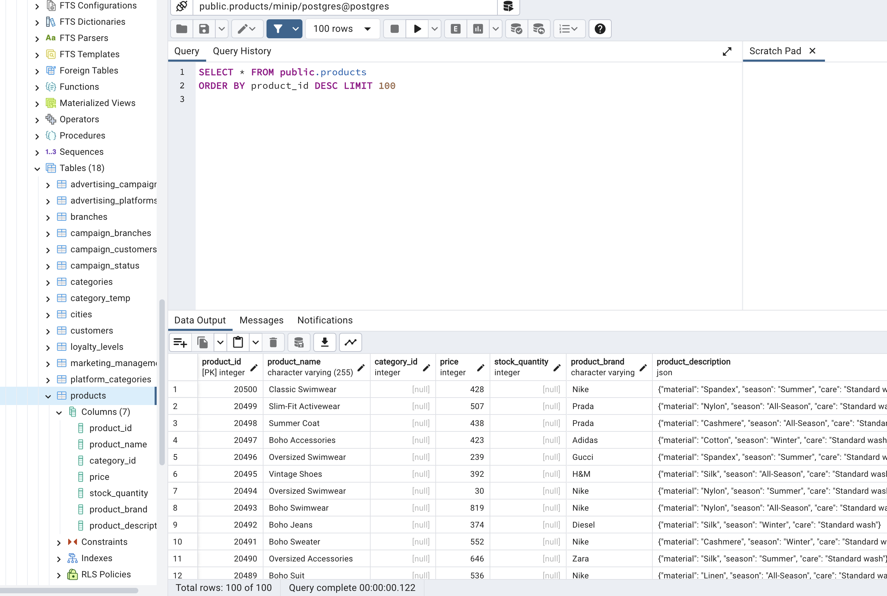

   - **הלבשת והוספת העמודות הייחודיות שלנו:** הוספנו לטבלת ה-Temp את העמודות המקוריות שלנו שהיו חסרות בטבלה שקיבלנו (לדוגמה עמודות שיווקיות ומלאי כמו `stock_quantity` ו-`sku`), כדי להבטיח שלמות נתונים מקסימלית ועמידה בדרישות של המערכת המקורית שלנו.
     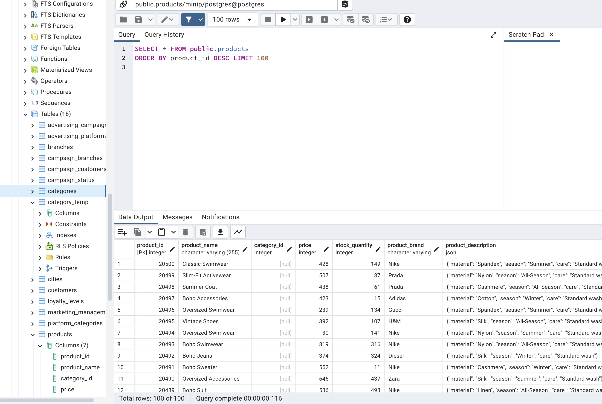

   - **חישוב וזיהוי הטווח ומזהה ה-ID המקסימלי במערכת (get_biggest_id):**
     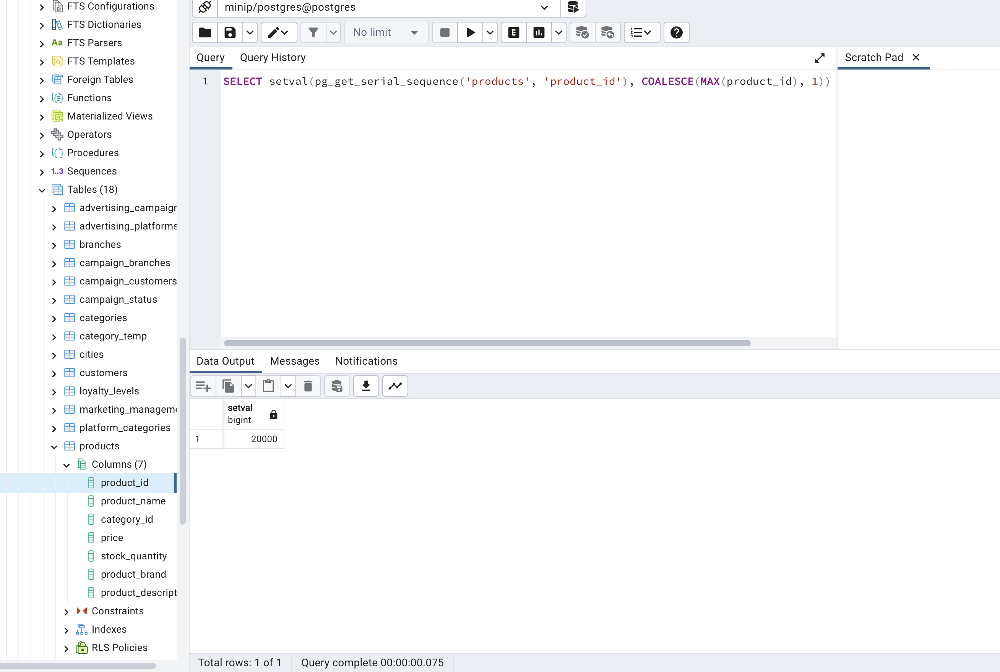

   - **הגדרת רצף המספור האוטומטי לקטגוריות החדשות (Auto-increment category_id):**
     .png)

   - **שינוי, השלמה ועידכון ערכים עבור העמודות החדשות (add_values_new_columns):**
     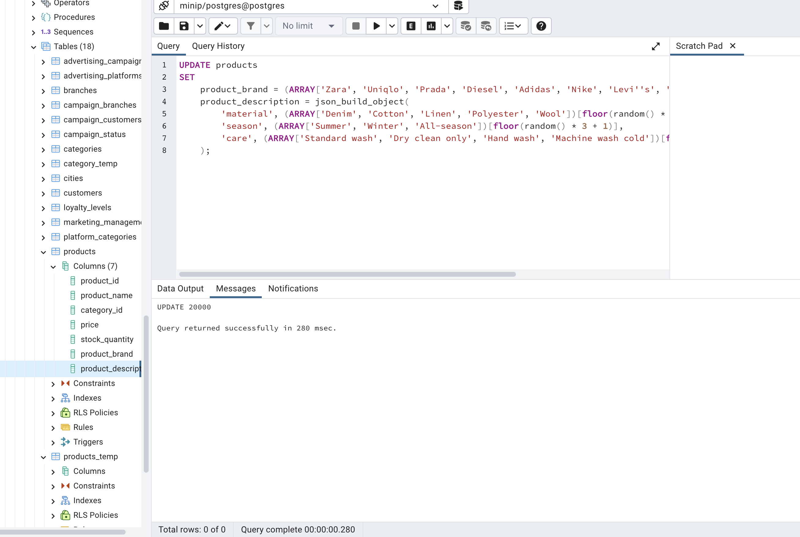

   - **מיזוג והעברה לטבלת המקור המשולבת:** לבסוף, העברנו ומיזגנו את כל הנתונים המסודרים מטבלת ה-Temp ישירות לתוך טבלת המוצרים המקורית/הראשית שלנו (`Products`). לקחנו את קולקציית המוצרים המלאה שלהם, הוספנו להם את העמודות המקוריות שלנו, וביצענו עדכון נתונים מונחה אילוצים.

3. **פקודות SQL לעדכון וסידור הנתונים לאחר המיזוג:**
   לאחר העברת הנתונים ושינויי האב-טיפוס, חלק מהערכים כגון מלאי קמפיין (`stock_quantity`) ומזהי קטגוריות (`category_id`) נותרו ריקים (Null) כיוון שלא היו קיימים במערכת החדשה שקיבלנו. פתרנו זאת באמצעות הרצת סקריפט עדכון ייעודי וחכם:
   
   * **השלמת ערכי מלאי מסיביים בצורה רנדומלית מתוחכמת (רמת מוכנות המלאי):**
     ```sql
     UPDATE products
     SET stock_quantity = floor(random() * 491 + 10)
     WHERE stock_quantity IS NULL;
     ```
     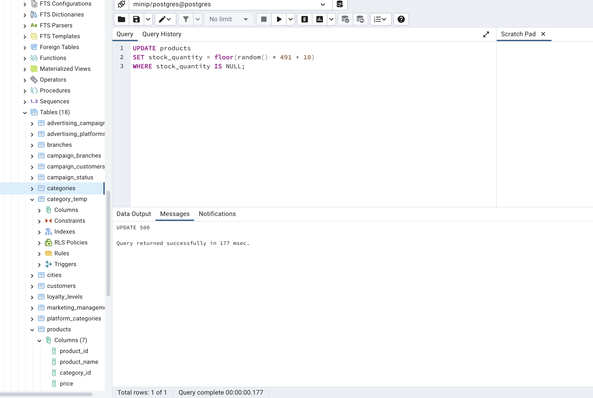
     
   * **סיווג ומיפוי קטגוריות חכם (Category Mapping) על פי שמות המוצרים ומבנה הקטגוריות הקיים:**
     ```sql
     UPDATE products p
     SET category_id = CASE
         -- if it's socks -> 506
         WHEN LOWER(split_part(p.product_name, ' ', 2)) = 'socks' THEN 506
         -- if it's a jacket or a coat -> 501
         WHEN LOWER(split_part(p.product_name, ' ', 2)) IN ('jacket', 'coat') THEN 501
         -- if it's a sweater -> 507
         WHEN LOWER(split_part(p.product_name, ' ', 2)) = 'sweater' THEN 507
     
         -- if it's a word without 's' at the end, look for a word with a 's' in the table categories
         WHEN LOWER(split_part(p.product_name, ' ', 2)) = 't-shirt'
             THEN (SELECT c.category_id FROM categories c WHERE LOWER(c.category_name) = 't-shirts' LIMIT 1)
         WHEN LOWER(split_part(p.product_name, ' ', 2)) = 'dress'
             THEN (SELECT c.category_id FROM categories c WHERE LOWER(c.category_name) = 'dresses' LIMIT 1)
         WHEN LOWER(split_part(p.product_name, ' ', 2)) = 'bag'
             THEN (SELECT c.category_id FROM categories c WHERE LOWER(c.category_name) = 'bags' LIMIT 1)
         WHEN LOWER(split_part(p.product_name, ' ', 2)) = 'skirt'
             THEN (SELECT c.category_id FROM categories c WHERE LOWER(c.category_name) = 'skirts' LIMIT 1)
         WHEN LOWER(split_part(p.product_name, ' ', 2)) = 'suit'
             THEN (SELECT c.category_id FROM categories c WHERE LOWER(c.category_name) = 'suits' LIMIT 1)
     
         -- else, look for ID in the table categories
         ELSE (SELECT c.category_id FROM categories c WHERE LOWER(c.category_name) = LOWER(split_part(p.product_name, ' ', 2)) LIMIT 1)
     END
     WHERE p.category_id IS NULL
       AND (
         LOWER(split_part(p.product_name, ' ', 2)) IN ('socks', 'jacket', 'coat', 't-shirt', 'dress', 'bag', 'skirt', 'suit','sweater')
         OR EXISTS (SELECT 1 FROM categories c WHERE LOWER(c.category_name) = LOWER(split_part(p.product_name, ' ', 2)))
       );
     ```
     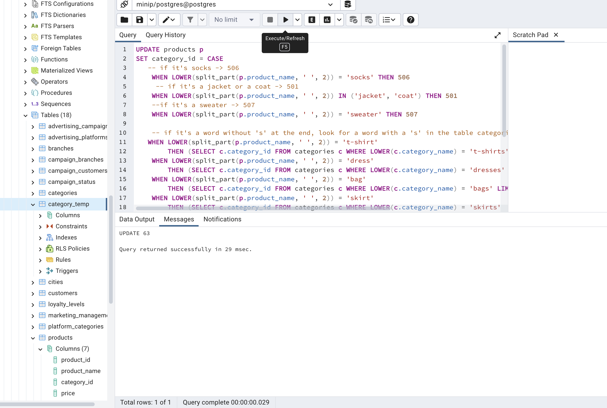

   * **שאילתת האינטגרציה לראיית המוצרים המשולבת (query_integration_products):**
     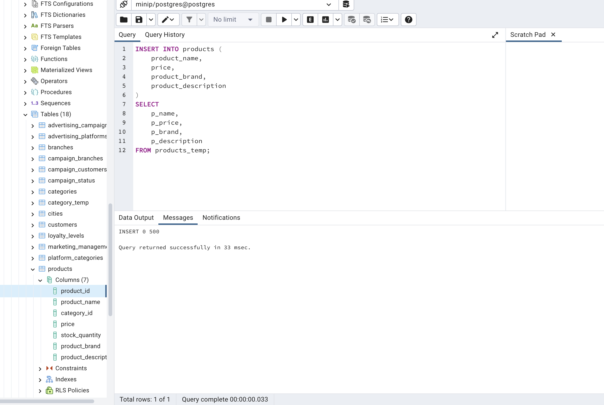

4. **תוצאת מבנה טבלת Products המשולבת:**
   טבלת המוצרים המאוחדת מכילה כעת את כל העמודות של האגף שקיבלנו פלוס העמודות הייחודיות שהיו חשובות לנו לקמפיינים שיווקיים:
   - `product_id` (מפתח ראשי, התבסס על `p_id`)
   - `product_name` (שם המוצר)
   - `product_brand` (מותג)
   - `product_description` (תיאור בפורמט JSON)
   - `price` (מחיר מוצר)
   - `category_id` (קישור ישיר לישות הקטגוריות החדשה `store_category`)
   - **העמודות שלנו שנוספו:** `stock_quantity` (כמות מלאי כללית) ו-`sku` (מק"ט ייחודי שיווקי).

### החלטות העיצוב בתרשים המשותף (ERD 3):
כפי שניתן לראות בתרשים ה-ERD המשולב (`erdplus 3`), האינטגרציה חיברה בצורה לוגית ופיזית בין העולם השיווקי לעולם ניהול המלאי והמחסנים:
1. **קישור קמפיינים וספקים:** תחת הישות של קמפיינים שיווקיים (`Advertising_Campaign`), נוסף מזהה ספק (`supplier_id`) המקשר אותה ישירות לישות הספקים שקיבלנו (`Suppliers`). הדבר מאפשר לדעת איזה ספק מממן או נותן חסות לכל קמפיין שיווקי.
2. **קישור מבצעים ומוצרים ספציפיים (Core Integration):**
   טבלת המבצעים המקורית שלנו (`Promotions`), שבמקור פנתה למוצרים ישירות, שודרגה. בתרשים המשותף (`erdplus 3`), נוצר קשר רבים-לרבים (M:N) דרך טבלת קישור חדשה `Promotion_Products` בין `Promotions` לבין `Products`. הדבר מאפשר להחיל מבצע קמפיין שיווקי אחד על מגוון רחב של מוצרים, או לשייך מוצר בודד למספר מבצעים שונים בו-זמנית.
3. **ניהול וריאציות ומלאי מחסנים:** ישות ה-`product_variants` מרוויחה ישירות מהמיזוג, שכן היא מקושרת כעת לטבלת ה-`Products` המשולבת המכילה גם את המידע השיווקי וגם את נתוני המותגים והקטגוריות השונים של חנות הבגדים.

---

## 3. מבטים ושילוב בסיסי הנתונים (Views & Queries)

כדי לאפשר לכל אגף להמשיך לפעול ביעילות ובמקביל ליהנות מהיתרון של בסיס הנתונים המשולב, הגדרנו מבטים מתקדמים (Views) המאפשרים שליפה ושאילתות לצרכים שונים:

### מבט 1: `marketing_view` (נקודת מבט שיווקית ופילוח מוצרים)
*   **תיאור מילולי**: מבט זה מיועד למחלקת השיווק לצורך אפיון ופילוח שיווקי של המוצרים במערכת. הוא מסווג את כל המוצרים שמחירם מעל 100 ש"ח כ"מוצרי יוקרה" (Luxury) ואת השאר כ"מוצרים נגישים פיננסית" (Affordable), תוך סינון פריטים שמחירם נמוך מ-50 ש"ח על מנת להתמקד במוצרי קצה איכותיים וקמפיינים מובילים.
*   **קוד משפט יצירת המבט**:
```sql
CREATE VIEW marketing_view AS
SELECT
    p.product_id AS product_code,
    p.product_name AS product_name,
    p.price AS price,
    CASE
        WHEN p.price > 100 THEN 'Luxury'
        ELSE 'Affordable'
    END AS marketing_position
FROM products p
WHERE p.price >= 50;
```

#### 📸 הוכחת יצירה והרצה של המבט ב-PostgreSQL (Query Tool):


#### 📸 תמונת תוצאות שליפת נתוני טבלת המבצע השיווקי (Table View):


---

### שאילתות משמעותיות על מבט 1:

#### 🔍 שאילתה 1.1: שליפת מוצרי יוקרה בלבד (Luxury Products)
*   **תיאור**: שאילתה השולפת את שמותיהם ומחיריהם של המוצרים המוגדרים כפריטי יוקרה בלבד, לצורך מיקוד קמפיינים פרסומיים ומבצעי פרימיום מונחי קהל יעד אמיד.
*   **קוד השאילתה**:
```sql
SELECT product_name, price
FROM marketing_view
WHERE marketing_position = 'Luxury';
```
#### 📸 הוכחה המציגה את פלט שאילתה 1.1:


#### 🔍 שאילתה 1.2: חישוב מחיר ממוצע של מוצרי פרימיום ויוקרה במערכת
*   **תיאור**: שאילתה פיננסית המחשבת את ממוצע המחירים עבור מוצרים המסווגים כיוקרה. מיועד לצורך תמחור קולקציות עתידיות והערכת שווי שוק.
*   **קוד השאילתה**:
```sql
SELECT AVG(price) AS average_price_premium
FROM marketing_view
WHERE marketing_position = 'Luxury';
```
#### 📸 הוכחה המציגה את פלט שאילתה 1.2:


---

### מבט 2: `logistic_view` (נקודת מבט לוגיסטית ובקרה על פריטים בחוסר)
*   **תיאור מילולי**: מבט זה מיועד למנהלי המלאי והלוגיסטיקה באגף החנות והמחסנים. המבט מקשר בין ישות המוצרים הראשית לבין טבלת הקטגוריות על מנת לאתר ולסמן מוצרים שהמלאי הכללי שלהם ירד מתחת לסף הקריטי של 10 יחידות ומצריך הזמנת מלאי דחופה ורכש ספקים מחודש.
*   **קוד משפט יצירת המבט**:
```sql
CREATE VIEW logistic_view AS
SELECT
    p.product_id AS product_code,
    p.product_name AS product_name,
    c.category_name AS category,
    p.stock_quantity AS left_quantity
FROM products p
JOIN categories c ON p.category_id = c.category_id
WHERE p.stock_quantity < 10;
```

#### 📸 הוכחת יצירה והרצה של המבט ב-PostgreSQL (Query Tool):


#### 📸 תמונת תוצאות שליפת נתוני טבלת המבט הלוגיסטי (Table View):


---

### שאילתות משמעותיות על מבט 2:

#### 🔍 שאילתה 2.1: איתור המוצר הבודד בעל יתרת המלאי הנמוכה והקריטית ביותר
*   **תיאור**: שאילתה דחופה המוצאת את המוצר הספציפי שבו רמת המלאי הגיעה לקצה החמור ביותר מכל מוצרי החנות (המלאי הנמוך ביותר), וזאת על מנת לתעדף עבורו פתיחת הזמנה מסודרת מספק באותו רגע.
*   **קוד השאילתה**:
```sql
SELECT product_name, left_quantity 
FROM logistic_view
ORDER BY left_quantity ASC
LIMIT 1;
```
#### 📸 הוכחה המציגה את פלט שאילתה 2.1:


#### 🔍 שאילתה 2.2: ספירת כמות המוצרים בחוסר לפי קטגוריות מוצרים (אזעקה אדומה)
*   **תיאור**: שאילתה המבצעת קבוצות סיכום (Group By) לספירת מספר הפריטים הנמצאים בסיכון ומלאי נמוך (מתחת ל-10) בכל קטגוריה, המאפשרת לאנשי הלוגיסטיקה לדעת באיזה מחלקה (גברים, נשים, אביזרים) המצב הוא הקריטי ביותר.
*   **קוד השאילתה**:
```sql
SELECT category, COUNT(*) AS red_alert_products
FROM logistic_view
GROUP BY category;
```
#### 📸 הוכחה המציגה את פלט שאילתה 2.2:


---

## 4. קבצי הגשה מוגשים ב-Git
כל החלקים הנדרשים לשלב ג' מוגשים תחת התיקייה `שלב ג` ומתויגים (Tagged) בצורה מסודרת:
1. **DSD ו-ERD של האגף החדש (ERD 4):** Reverse Engineering של המערכת שנתקבלה.
2. **ERD משותף לאחר אינטגרציה (ERD 3):** תבנית תכנון משולבת של שני בסיסי הנתונים.
3. **Integrate.sql:** פקודות SQL ששימשו ליצירת טבלאות האגף שנתקבל, יצירת המפתחות הזרים לקשר הלוגי והזנת נתוני הבדיקה הראשוניים.
4. **Views.sql:** פקודות ה-SQL המפרטות את הגדרת שתי המבטים החקירתיים הראשיים והשאילתות העמוקות על פניהם.
5. **backup3.sql:** קובץ גיבוי SQL Dump עדכני ומלא של בסיס הנתונים המשולב הכולל את כל הטבלאות, האילוצים והנתונים המוזנים לתצוגה חלקה.
