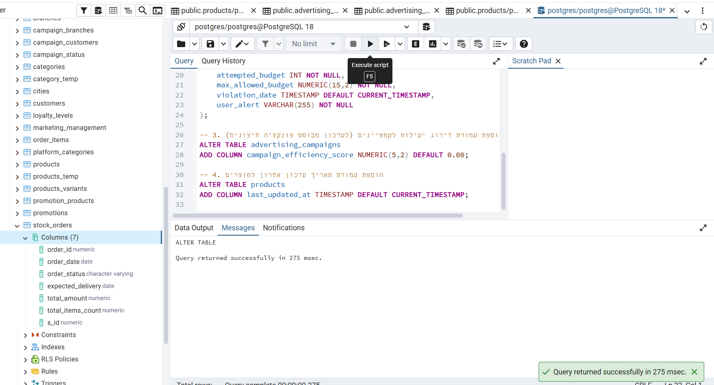
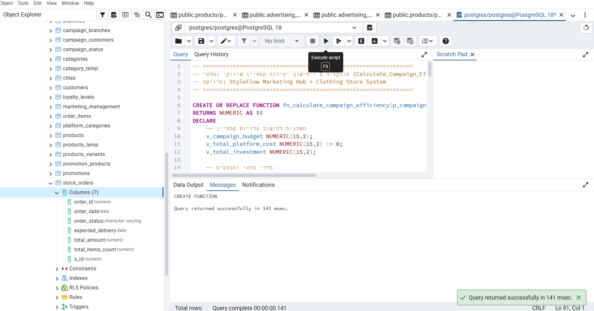
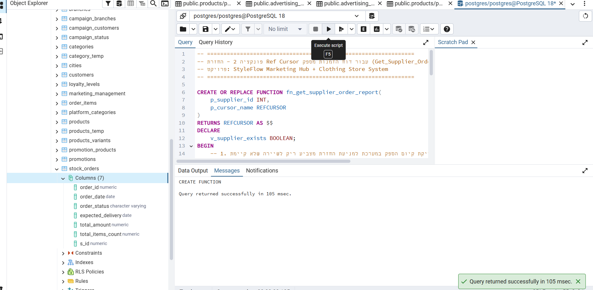
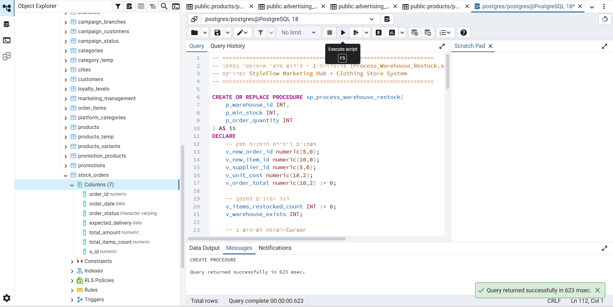
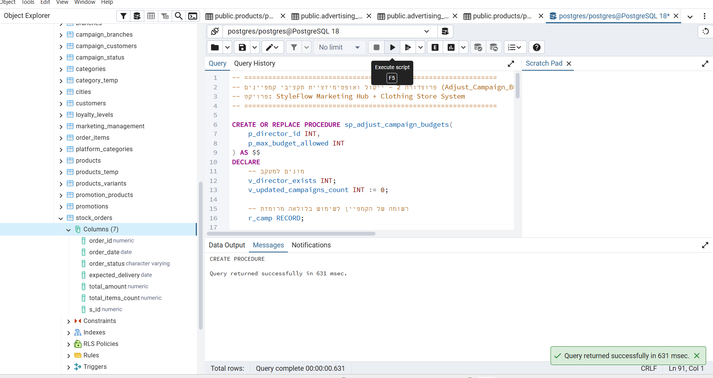
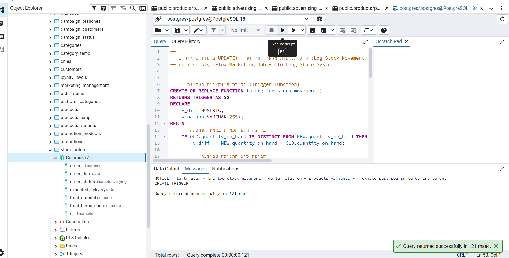
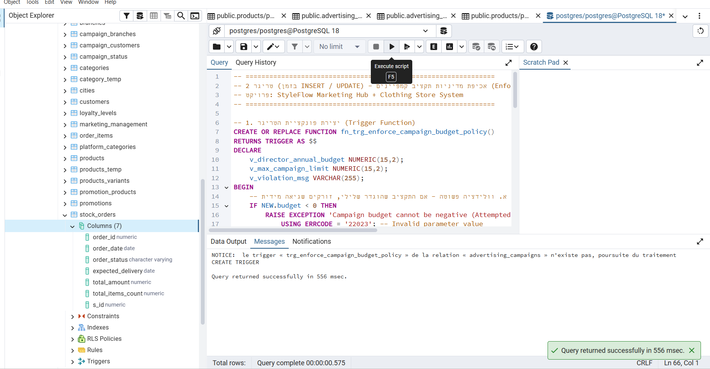
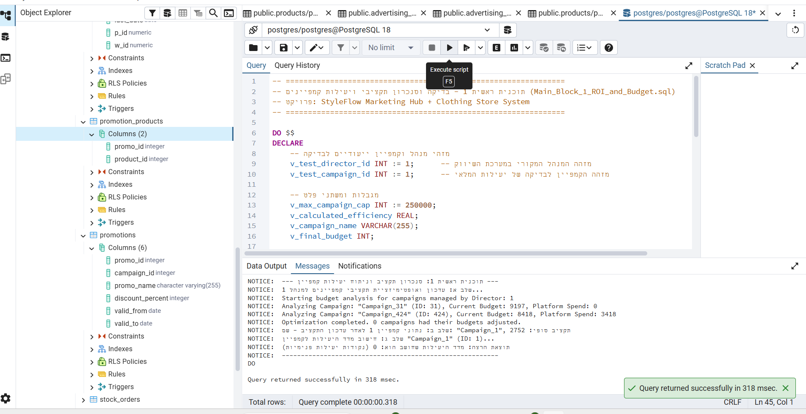
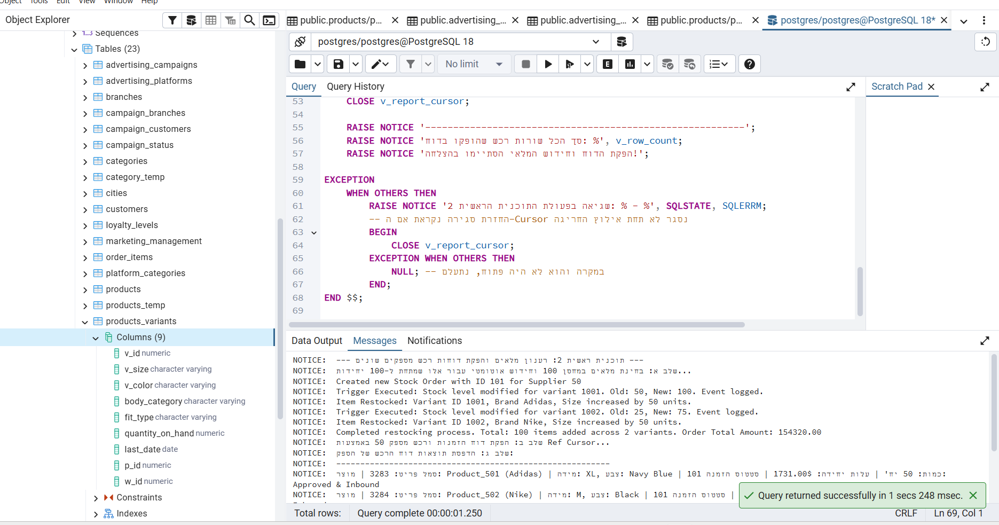
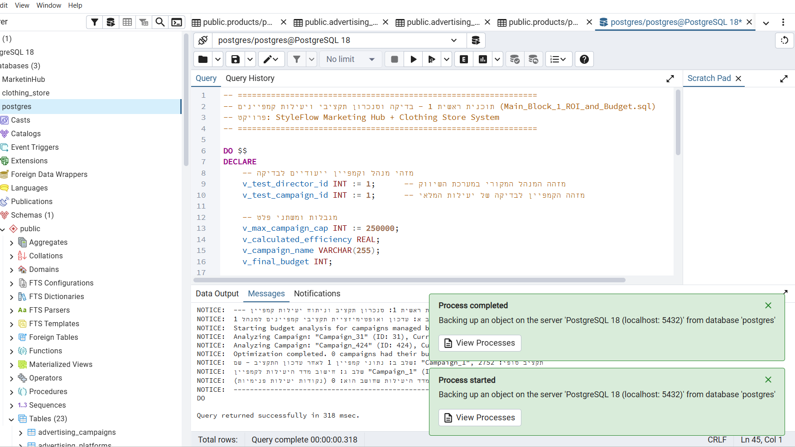

# שלב ד' - תוכניות PL/pgSQL ובקרה בבסיס הנתונים (StyleFlow Marketing & Inventory Hub)

בשנת הפעילות הנוכחית של הפרויקט, פיתחנו מעטפת לוגית מתקדמת בתוך מסד הנתונים PostgreSQL באמצעות שפת **PL/pgSQL**. מטרת שלב זה היא בניית פתרונות לא-טריוויאליים לשמירה על עקביות הנתונים, מעקב מקיף אחרי פעולות (Auditing), ואופטימיזציה של תהליכים עסקיים בשני אגפי הפרויקט הממוזגים: אגף השיווק (**StyleFlow Marketing Hub**) ואגף ניהול ורכש המלאי (**Clothing Store System**).

---

## 📋 פירוט התוצרים בתיקיית "שלב ד"

1. **`AlterTable.sql`**: פקודות לעדכון מבנה הטבלאות (הקמת טבלאות לוג מלאי, לוג חריגות תקציב, והוספת עמודות תפעוליות לביקורת פיננסית).
2. **`Calculate_Campaign_Efficiency.sql`**: פונקציית לוגיקה עסקית מורכבת להערכת יעילות הקמפיין והזנת תוצאה מעודכנת בטבלה.
3. **`Get_Supplier_Order_Report.sql`**: פונקציה המחזירה מצביע `REFCURSOR` לקבלת דוח מותאם של הזמנות רכש מספק.
4. **`Process_Warehouse_Restock.sql`**: פרוצדורה מתקדמת לסריקת המלאי במחסן, איתור חוסרים, פתיחת הזמנת רכש חלקה מול ספק ועדכון מלאי המחסנים.
5. **`Adjust_Campaign_Budgets.sql`**: פרוצדורה משוכללת לסריקה ואופטימיזציה של תקציבי קמפיינים בהתאם לעלויות פלטפורמה וביטחונות.
6. **`Log_Stock_Movement.sql`**: טריגר מצב מלאי `AFTER UPDATE` המתעד כל תנועת יחידות מלאי ומתריע במקרים של רמת מלאי נמוכה מקיבולת ביטחון.
7. **`Enforce_Campaign_Budget_Policy.sql`**: טריגר תקציבי מתוחכם `BEFORE INSERT OR UPDATE` המונע חריגה ממדיניות מימון שנתית ומבצע שינוי נתונים ריכוזי אוטומטי.
8. **`Main_Block_1_ROI_and_Budget.sql`**: תוכנית ראשית המממשת אופטימיזציית תקציבים, הפעלה עקיפה של טריגרי הבטחת תקציב, ואומדן ציוני יעילות שיווקית.
9. **`Main_Block_2_Inventory_and_Order.sql`**: תוכנית ראשית חכמה להפעלת תכנון וחידוש מלאי מלא, הזנקת לוגים של מלאי, והפקת דוחות ספקים דרך Cursor.
10. **`backup4.sql`**: קובץ גיבוי מלא, מוגמר ומעודכן הכולל את כל סוגי הטבלאות, המבטים, נתוני המטרות, והתוכניות של שלב ד'.

---

## 🛠️ 1. פקודות שינויי מבנה (`AlterTable.sql`)

לשם הטמעת התוכניות הראשיות והטריגרים האוטומטיים שיצרנו, ביצענו מספר שינויי מבנה במסד הנתונים:
* **`store_stock_audit_log`**: טבלת שרת איתנה המתעדת כל שינוי במלאי הווריאציות, מימדי הפער, וזמני עדכון מדויקים.
* **`campaign_budget_violations_log`**: טבלת בקרת חריגות מימון, אליה נזרקים נתוני קמפיינים שניסו לעבור על חוקי התקציב השנתיים.
* **`campaign_efficiency_score`**: עמודה חדשה שהוספה לתוך טבלת הקמפיינים המאפשרת שמירה וניתוח קבועים של איכות המדיה והשקעות השיווק.

```sql
-- 1. יצירת טבלת מעקב לתיעוד תנועות מלאי ומחסנים
CREATE TABLE store_stock_audit_log (
    log_id INT GENERATED ALWAYS AS IDENTITY PRIMARY KEY,
    v_id numeric(10,0) NOT NULL,
    old_quantity numeric(5,0),
    new_quantity numeric(5,0),
    change_date timestamp DEFAULT CURRENT_TIMESTAMP,
    action_taken varchar(255) NOT NULL
);

-- 2. יצירת טבלת מעקב אחרי חריגות תקציב של קמפיינים שיווקיים
CREATE TABLE campaign_budget_violations_log (
    violation_id INT GENERATED ALWAYS AS IDENTITY PRIMARY KEY,
    campaign_id INT NOT NULL,
    attempted_budget INT NOT NULL,
    max_allowed_budget NUMERIC(15,2) NOT NULL,
    violation_date TIMESTAMP DEFAULT CURRENT_TIMESTAMP,
    user_alert VARCHAR(255) NOT NULL
);

-- 3. הוספת עמודת דירוג יעילות לקמפיינים תחת הטבלה הראשית
ALTER TABLE advertising_campaigns ADD COLUMN campaign_efficiency_score NUMERIC(5,2) DEFAULT 0.00;

-- 4. הוספת עמודת תאריך עדכון אחרון למוצרים
ALTER TABLE products ADD COLUMN last_updated_at TIMESTAMP DEFAULT CURRENT_TIMESTAMP;
```

### 📸 צילום מסך של פקודות שינויי המבנה ויצירת הטבלאות ב-PostgreSQL:


---

## 📊 2. תיאור וקוד הפונקציות (Functions)

### א. פונקציה 1: `fn_calculate_campaign_efficiency` (חישוב יעילות ומלאי קמפיין)
* **תיאור מילולי**: הפונקציה מנתחת קמפיין שיווקי ומחשבת עבורו יחס יעילות משוקלל. היא בוחנת את השקעת המשאבים הכוללת (תקציב קמפיין + עלויות פלטפורמה) אל מול זמינות המלאי ואחוזי ההנחה בקמפיין דרך טבלת קישור מוצרי המבצעים. 
* **אלמנטים תכנותיים**:
  * שימוש ב-**Explicit Cursor** (`cur_promotions`) המבצע הצטרפות (Join) עם טבלת הגשר `promotion_products` וטבלת המלאי `products_variants` לסריקה יעילה בלולאה.
  * שימוש ב-**Implicit Cursor** לצורך גזירת חישובים מהירים של סך עלות פלטפורמות הקמפיין.
  * בדיקה מקיפה ומניעת חזיית קריסה שכזו במצבים של חלוקה באפס בעזרת קטע **EXCEPTION** מלוטש.
  * ביצוע עדכון נתונים פנימי (**DML Update**) בגוף הפונקציה לעדכון הציון ישירות בטבלה.

* **קוד הפונקציה**:
```sql
CREATE OR REPLACE FUNCTION fn_calculate_campaign_efficiency(p_campaign_id INT)
RETURNS NUMERIC AS $$
DECLARE
    v_campaign_budget NUMERIC(15,2);
    v_total_platform_cost NUMERIC(15,2) := 0;
    v_total_investment NUMERIC(15,2);
    v_total_promoted_stock NUMERIC(15,0) := 0;
    v_weighted_discount NUMERIC(15,2) := 0;
    v_efficiency_score NUMERIC(5,2) := 0.00;
    r_promo RECORD;
    
    -- הגדרת Cursor מפורש (Explicit Cursor) לחישוב יעילות לפי מוצרים ומלאים
    cur_promotions CURSOR FOR 
        SELECT p.promo_id, p.discount_percent, pp.product_id, pv.quantity_on_hand
        FROM promotions p
        LEFT JOIN promotion_products pp ON p.promo_id = pp.promo_id
        LEFT JOIN products_variants pv ON pp.product_id = pv.p_id
        WHERE p.campaign_id = p_campaign_id;
BEGIN
    SELECT budget INTO v_campaign_budget FROM advertising_campaigns WHERE campaign_id = p_campaign_id;
    IF NOT FOUND THEN
        RAISE EXCEPTION 'Campaign with ID % does not exist.', p_campaign_id;
    END IF;
    
    SELECT COALESCE(SUM(price), 0) INTO v_total_platform_cost FROM advertising_platforms WHERE campaign_id = p_campaign_id;
    v_total_investment := COALESCE(v_campaign_budget, 0) + v_total_platform_cost;
    
    IF v_total_investment = 0 THEN
        RAISE EXCEPTION 'Division by zero: Total investment is 0 for campaign %.', p_campaign_id;
    END IF;

    OPEN cur_promotions;
    LOOP
        FETCH cur_promotions INTO r_promo;
        EXIT WHEN NOT FOUND;
        
        IF r_promo.quantity_on_hand IS NOT NULL AND r_promo.quantity_on_hand > 0 THEN
            v_total_promoted_stock := v_total_promoted_stock + r_promo.quantity_on_hand;
            v_weighted_discount := v_weighted_discount + (r_promo.quantity_on_hand * (r_promo.discount_percent / 100.0));
        END IF;
    END LOOP;
    CLOSE cur_promotions;

    IF v_total_promoted_stock > 0 THEN
        v_efficiency_score := LEAST(((v_weighted_discount * 1000.0) / v_total_investment), 999.99);
    ELSE
        v_efficiency_score := 0.00;
    END IF;
    
    UPDATE advertising_campaigns SET campaign_efficiency_score = v_efficiency_score WHERE campaign_id = p_campaign_id;
    RETURN v_efficiency_score;
EXCEPTION
    WHEN division_by_zero THEN
        RETURN 0.00;
    WHEN OTHERS THEN
        RETURN -1.00;
END;
$$ LANGUAGE plpgsql;
```

### 📸 צילום מסך של פונקציית חישוב יעילות קמפיין:


---

### ב. פונקציה 2: `fn_get_supplier_order_report` (החזרת Ref Cursor עבור דוח ספק)
* **תיאור מילולי**: פונקציה מתוחכמת המייצרת ומחזירה מצביע דינמי מסוג `REFCURSOR`. היא מקבלת ספק ובודקת קודם כל את קיומו. לאחר מכן, היא פותחת מצביע לשאילתה מורכבת המחברת את הזמנות הרכש מהספק עם פריטי הרכש, המלאים, המותגים והמידות, ומחזירה את המצביע למערכות הקוראות.
* **אלמנטים תכנותיים**:
  * החזרת **Ref Cursor** כמבוקש לקריאה יעילה וסטרימינג של נתונים בצד לקוח.
  * טיפול מובנה בשגיאה מותאמת אם הספק לא קיים באקספשן ייעודי ומכופל (**Custom Exception Handling**).

* **קוד הפונקציה**:
```sql
CREATE OR REPLACE FUNCTION fn_get_supplier_order_report(p_supplier_id INT, p_cursor_name REFCURSOR)
RETURNS REFCURSOR AS $$
DECLARE
    v_supplier_exists BOOLEAN;
BEGIN
    SELECT EXISTS(SELECT 1 FROM suppliers WHERE s_id = p_supplier_id) INTO v_supplier_exists;
    
    IF NOT v_supplier_exists THEN
        RAISE EXCEPTION 'Supplier with ID % not found.', p_supplier_id;
    END IF;

    OPEN p_cursor_name FOR
        SELECT 
            so.order_id, so.order_date, so.order_status, so.total_amount,
            oi.item_id, oi.unit_cost, oi.quantity,
            pv.v_size, pv.v_color, p.product_name AS p_name, p.product_brand AS p_brand
        FROM stock_orders so
        LEFT JOIN order_items oi ON so.order_id = oi.order_id
        LEFT JOIN products_variants pv ON oi.v_id = pv.v_id
        LEFT JOIN products p ON pv.p_id = p.product_id
        WHERE so.s_id = p_supplier_id
        ORDER BY so.order_date DESC;

    RETURN p_cursor_name;
END;
$$ LANGUAGE plpgsql;
```

### 📸 צילום מסך של פונקציית הפקת דוח הזמנות ספק באמצעות Ref Cursor:


---

## 📈 3. תיאור וקוד הפרוצדורות (Procedures)

### א. פרוצדורה 1: `sp_process_warehouse_restock` (חידוש מלאי ורכש אוטומטי במחסן)
* **תיאור מילולי**: פרוצדורה תפעולית חשובה העוסקת בניהול מלאי ורכש חוצה-אגפים. היא מקבלת מחסן, רף מינימום קריטי לפריט, וכמות רכישה קבועה. הפרוצדורה משתמשת ב-Cursor מפורש לסרוק את כל וריאציות הפריטים במחסן הנתון. לכל וריאציה שירדה מתחת לסף:
  1. יוצרת או מוצאת הזמנת רכש (Stock Order) פתוחה מול ספק ברירת המחדל (ספק מזהה 50).
  2. מחשבת את עלות הפריט מהספק (60% ממחיר המכירה של החנות).
  3. מוסיפה שורת רכש (`order_items`) ומעדכנת בצבירה את נפח ההזמנה הכולל.
  4. **מעדכנת באופן ישיר את זמינות המלאי במחסן** כדי להשיב אותו למצב מאוזן (מעדכן את טבלת `products_variants` - דבר אשר **מידית מפעיל את טריגר 1 של המלאי**).
* **אלמנטים תכנותיים**:
  * שימוש ב-**Explicit Cursor** עם לולאת סריקה פנימית.
  * פקודות **DML רבות** (פעולות INSERT מרובות לטבלת פריטים, עדכוני UPDATE מרובים למלאים, ועדכון סופי לכותרת ההזמנה).
  * טיפול בשגיאות מובנה לשמירה על יציבות ושלמות המחסן.

* **קוד הפרוצדורה**:
```sql
CREATE OR REPLACE PROCEDURE sp_process_warehouse_restock(p_warehouse_id INT, p_min_stock INT, p_order_quantity INT)
AS $$
DECLARE
    v_new_order_id numeric(5,0);
    v_new_item_id numeric(10,0);
    v_supplier_id numeric(5,0) := 50;
    v_unit_cost numeric(10,2);
    v_order_total numeric(10,2) := 0;
    v_items_restocked_count INT := 0;
    v_warehouse_exists INT;
    r_variant RECORD;
    cur_low_stock CURSOR FOR
        SELECT pv.v_id, pv.quantity_on_hand, p.price AS p_price, p.product_brand AS p_brand
        FROM products_variants pv
        JOIN products p ON pv.p_id = p.product_id
        WHERE pv.w_id = p_warehouse_id AND pv.quantity_on_hand < p_min_stock;
BEGIN
    SELECT COUNT(*) INTO v_warehouse_exists FROM warehouses WHERE w_id = p_warehouse_id;
    IF v_warehouse_exists = 0 THEN
        RAISE EXCEPTION 'Warehouse % not found.', p_warehouse_id;
    END IF;
    
    OPEN cur_low_stock;
    LOOP
        FETCH cur_low_stock INTO r_variant;
        EXIT WHEN NOT FOUND;
        
        v_unit_cost := r_variant.p_price * 0.60;
        
        IF v_items_restocked_count = 0 THEN
            SELECT COALESCE(MAX(order_id), 1000) + 1 INTO v_new_order_id FROM stock_orders;
            INSERT INTO stock_orders (order_id, order_date, order_status, total_amount, s_id)
            VALUES (v_new_order_id, CURRENT_DATE, 'Restock Draft', 0, v_supplier_id);
        END IF;
        
        SELECT COALESCE(MAX(item_id), 5000) + 1 INTO v_new_item_id FROM order_items;
        
        INSERT INTO order_items (item_id, unit_cost, quantity, order_id, v_id)
        VALUES (v_new_item_id, v_unit_cost, p_order_quantity, v_new_order_id, r_variant.v_id);
        
        v_order_total := v_order_total + (v_unit_cost * p_order_quantity);
        v_items_restocked_count := v_items_restocked_count + 1;
        
        -- פעולת DML הגוררת הפעלה אוטומטית של טריגר 1 של המלאי!
        UPDATE products_variants
        SET quantity_on_hand = quantity_on_hand + p_order_quantity
        WHERE v_id = r_variant.v_id;
    END LOOP;
    CLOSE cur_low_stock;
    
    IF v_items_restocked_count > 0 THEN
        UPDATE stock_orders
        SET total_amount = v_order_total, order_status = 'Approved & Inbound'
        WHERE order_id = v_new_order_id;
    END IF;
END;
$$ LANGUAGE plpgsql;
```

### 📸 צילום מסך של פרוצדורת ניהול וחידוש המלאי במחסן:


---

### ב. פרוצדורה 2: `sp_adjust_campaign_budgets` (ייעול ואופטימיזציה פיננסית של קמפיינים)
* **תיאור מילולי**: פרוצדורה פיננסית העוברת בלולאה מרומזת על כל הקמפיינים של מנהל מסוים, ומבצעת התאמות תקציביות חכמות:
  1. מחשבת את עלות הפלטפורמות שהוקצו תחת כל קמפיין בפיתוח שטח המודעות.
  2. אם עלות המדיה קרובה מאוד לתקציב (מעל 80%), הפרוצדורה מגדילה אוטומטית את תקציב הקמפיין ב-25% כדי למנוע עצירת פעילות ופגיעה בחשיפה.
  3. היא מקבלת משתנה ביטחון `p_max_budget_allowed` המהווה תקרת ברזל פיננסית שאותה הקמפיין לא יכול לחצות בשילוב חוקי המנהל.
  4. אם התקציב החדש עובר את המקסימום, הוא נחסם ומכויל לתקרת הברזל.
  5. אם עלויות המדיה המנוצלות קטנות מ-40% מהתקציב, הפרוצדורה מצמצמת ב-10% חלק מבוזבז של תקציב ומפנה אותו לשימוש שרתים אחרים במערכת.
* **אלמנטים תכנותיים**:
  * שימוש ב-**Implicit Cursor** בלולאת `FOR rec IN SELECT ...` יעילה במיוחד השומרת משאבי שרת.
  * התפצלויות מורכבות ומאורגנות (**Nested IF-ELSE Branches**).
  * עדכוני DML על טבלת הקמפיינים, המנוטרים בזמינות בלעדית על ידי טריגר 2 של הבקרה.

* **קוד הפרוצדורה**:
```sql
CREATE OR REPLACE PROCEDURE sp_adjust_campaign_budgets(p_director_id INT, p_max_budget_allowed INT)
AS $$
DECLARE
    v_director_exists INT;
    r_camp RECORD;
    v_platform_costs_sum INT;
    v_suggested_new_budget INT;
BEGIN
    SELECT COUNT(*) INTO v_director_exists FROM marketing_management WHERE director_id = p_director_id;
    IF v_director_exists = 0 THEN
        RAISE EXCEPTION 'Director % not found in Marketing.', p_director_id;
    END IF;

    FOR r_camp IN 
        SELECT campaign_id, budget
        FROM advertising_campaigns
        WHERE director_id = p_director_id
    LOOP
        SELECT COALESCE(SUM(price), 0) INTO v_platform_costs_sum
        FROM advertising_platforms
        WHERE campaign_id = r_camp.campaign_id;
        
        IF v_platform_costs_sum >= (r_camp.budget * 0.80) THEN
            v_suggested_new_budget := GREATEST(r_camp.budget * 1.25, v_platform_costs_sum + 5000);
            
            IF v_suggested_new_budget > p_max_budget_allowed THEN
                v_suggested_new_budget := p_max_budget_allowed;
            END IF;
            
            UPDATE advertising_campaigns
            SET budget = v_suggested_new_budget
            WHERE campaign_id = r_camp.campaign_id;
            
        ELSIF v_platform_costs_sum < (r_camp.budget * 0.40) AND r_camp.budget > 10000 THEN
            v_suggested_new_budget := r_camp.budget * 0.90;
            
            UPDATE advertising_campaigns
            SET budget = v_suggested_new_budget
            WHERE campaign_id = r_camp.campaign_id;
        END IF;
    END LOOP;
END;
$$ LANGUAGE plpgsql;
```

### 📸 צילום מסך של פרוצדורת אופטימיזציית תקציבי שיווק:


---

## 🔔 4. תיאור וקוד הטריגרים (Triggers)

### א. טריגר 1 (בזמן UPDATE) - תיעוד שינויי מלאי ואזהרות חוסר (`trg_log_stock_movement`)
* **תיעוד מילולי וזמן הפעלה**: הטריגר מופעל **AFTER UPDATE** על טבלת וריאציות מוצרי הלבוש (`products_variants`), כלומר מופעל מיד בזמן עדכון המלאי.
* **פעולת הטריגר**: בוחן אם יש פער בין כמות המלאי הישנה לכמות החדשה. הוא מייצר פקודת מעקב מפורטת ומוסיף רישום איתן בטבלת הלוג `store_stock_audit_log`. אם הכמות שומרת על יתרה נמוכה מ-10 חתיכות, הוא משרשר באופן דינמי הודעת אזהרה קריטית המאפשרת לאנשי המלאי לדעת מיד שיש לפתוח הזמנה חדשה.

* **קוד הטריגר ופונקציית העזר שלו**:
```sql
CREATE OR REPLACE FUNCTION fn_trg_log_stock_movement()
RETURNS TRIGGER AS $$
DECLARE
    v_diff NUMERIC;
    v_action VARCHAR(255);
BEGIN
    IF OLD.quantity_on_hand IS DISTINCT FROM NEW.quantity_on_hand THEN
        v_diff := NEW.quantity_on_hand - OLD.quantity_on_hand;
        
        IF v_diff > 0 THEN
            v_action := 'STOCK_INCREASE: Received ' || v_diff || ' units.';
        ELSE
            v_action := 'STOCK_DECREASE: Distributed ' || ABS(v_diff) || ' units.';
        END IF;

        IF NEW.quantity_on_hand < 10 THEN
            v_action := v_action || ' WARNING: Stock dropped below limit (' || NEW.quantity_on_hand || ').';
        END IF;

        INSERT INTO store_stock_audit_log (v_id, old_quantity, new_quantity, action_taken)
        VALUES (NEW.v_id, OLD.quantity_on_hand, NEW.quantity_on_hand, v_action);
    END IF;
    RETURN NEW;
END;
$$ LANGUAGE plpgsql;

CREATE TRIGGER trg_log_stock_movement
AFTER UPDATE ON products_variants
FOR EACH ROW
EXECUTE FUNCTION fn_trg_log_stock_movement();
```

### 📸 צילום מסך של טריגר רישום תנועות מלאי וביקורת:


---

### ב. טריגר 2 (בזמן UPDATE / INSERT) - אכיפת מדיניות תקציב קמפיינים (`trg_enforce_campaign_budget_policy`)
* **תיעוד מילולי וזמן הפעלה**: מופעל **BEFORE INSERT OR UPDATE** (לפני החלת השינוי בפועל בבסיס הנתונים) על טבלת הקמפיינים השיווקיים (`advertising_campaigns`).
* **פעולת הטריגר**:
  1. בודק אם תקציב הקמפיין המבוקש שלילי. במידה וכן - זורק שגיאה קשה מיידית וקוטע את ביצוע השאילתה לשמירת אמינות הנתונים.
  2. שולף את הערך של התקציב השנתי הכולל של המנהל המנהל את הקמפיין מטבלת המטה `marketing_management.annual_budget`.
  3. אוכף חוק פיננסי: **אסור לקמפיין פרסומי בודד לצרוך מעל 50% מהתקציב השנתי של המנהל שלו**.
  4. אם ישנה חריגה: במקום להכשיל את כל הטרנזקציה (דבר שיפגע בחנות), הטריגר רושם אוטומטית שורת פרטי חריגה בטבלת הלוג `campaign_budget_violations_log` המיועדת לקמפיינים המפרים ובמקביל **מכייל ומשנה דינמית** (`NEW.budget`) את התקציב שמוזן לקמפיין לנקודת המקסימום המותרת בדיוק (50% מתקציב המנהל השנתי).

* **קוד הטריגר ופונקציית העזר שלו**:
```sql
CREATE OR REPLACE FUNCTION fn_trg_enforce_campaign_budget_policy()
RETURNS TRIGGER AS $$
DECLARE
    v_director_annual_budget NUMERIC(15,2);
    v_max_campaign_limit NUMERIC(15,2);
    v_violation_msg VARCHAR(255);
BEGIN
    IF NEW.budget < 0 THEN
        RAISE EXCEPTION 'Campaign budget cannot be negative (%).', NEW.budget;
    END IF;

    SELECT annual_budget INTO v_director_annual_budget
    FROM marketing_management
    WHERE director_id = NEW.director_id;

    IF v_director_annual_budget IS NOT NULL THEN
        v_max_campaign_limit := v_director_annual_budget * 0.50;
        
        IF NEW.budget > v_max_campaign_limit THEN
            v_violation_msg := 'POL-VIOLATION: Budget ' || NEW.budget || ' violates the 50% cap of director budget (' || v_max_campaign_limit || ').';
            
            INSERT INTO campaign_budget_violations_log (campaign_id, attempted_budget, max_allowed_budget, user_alert)
            VALUES (NEW.campaign_id, NEW.budget, v_max_campaign_limit, v_violation_msg);
            
            NEW.budget := CAST(v_max_campaign_limit AS INT);
        END IF;
    END IF;
    RETURN NEW;
END;
$$ LANGUAGE plpgsql;

CREATE TRIGGER trg_enforce_campaign_budget_policy
BEFORE INSERT OR UPDATE ON advertising_campaigns
FOR EACH ROW
EXECUTE FUNCTION fn_trg_enforce_campaign_budget_policy();
```

### 📸 צילום מסך של טריגר בקרת אכיפת תקציב ואחריות פיננסית:


---

## 🚀 5. תיאור וקוד התוכניות הראשיות (Scripts / Main Blocks)

כדי לאמת את פעילות ושילוב השגרות שיצרנו, כתבנו שתי תוכניות ראשיות המריצות את כל השלבים של המערכות הממוזגות.

### א. תוכנית ראשית 1: בדיקת תקציבים ואומדן מדד יעילות קמפיין (`Main_Block_1_ROI_and_Budget.sql`)
* **תיאור מילולי**: התוכנית מדמה תהליך שגרה תקופתי עבור אגף השיווק של החנות. 
  1. קוראת לפרוצדורה `sp_adjust_campaign_budgets` לצורך התאמת תקציבי כל הקמפיינים המשויכים למנהלת 1 (שרה לוי), תוך הגבלת תקרה קבועה של 250,000$. מהלך זה מפעיל מאחורי הקלעים את טריגר 2 של בקרת התקציב לשמירה על חוק ה-50%.
  2. קוראת לפונקציה `fn_calculate_campaign_efficiency` עבור קמפיין מספר 1, המחשבת על בסיס מודל המלאי, ההנחות והשקעת המדיה את ציון היעילות לקולקציה, מעדכנת את הטבלה ומציגה פלט ידידותי למשתמש.

```sql
DO $$
DECLARE
    v_test_director_id INT := 1;
    v_test_campaign_id INT := 1;
    v_max_campaign_cap INT := 250000;
    v_calculated_efficiency REAL;
    v_campaign_name VARCHAR(255);
    v_final_budget INT;
BEGIN
    RAISE NOTICE '--- תוכנית ראשית 1: סנכרון תקציב וניתוח יעילות קמפיין ---';
    
    RAISE NOTICE 'שלב א: עדכון ואופטימיזציית תקציבי קמפיינים למנהל %...', v_test_director_id;
    CALL sp_adjust_campaign_budgets(v_test_director_id, v_max_campaign_cap);
    
    SELECT campaign_name, budget INTO v_campaign_name, v_final_budget
    FROM advertising_campaigns
    WHERE campaign_id = v_test_campaign_id;
    
    RAISE NOTICE 'שלב ב: נתוני קמפיין % לאחר עדכון התקציב - שם: "%", תקציב סופי: %', 
        v_test_campaign_id, v_campaign_name, v_final_budget;
        
    RAISE NOTICE 'שלב ג: חישוב מדד היעילות לקמפיין "%" (ID: %)...', v_campaign_name, v_test_campaign_id;
    v_calculated_efficiency := fn_calculate_campaign_efficiency(v_test_campaign_id);
    
    RAISE NOTICE 'תוצאת הרצה: מדד היעילות שחושב הוא: % (נקודות יעילות פנימיות)', v_calculated_efficiency;
    RAISE NOTICE '---------------------------------------------------------';
EXCEPTION
    WHEN OTHERS THEN
        RAISE NOTICE 'שגיאה בפעולת התוכנית הראשית 1: % - %', SQLSTATE, SQLERRM;
END $$;
```

### 📸 צילום מסך של הרצת תוכנית ראשית 1 בהצלחה ב-pgAdmin:


---

### ב. תוכנית ראשית 2: בקרה, חידוש מלאי והפקה של דוח רכש ספקים (`Main_Block_2_Inventory_and_Order.sql`)
* **תיאור מילולי**: התוכנית מדמה תהליך חידוש מלאי מלא ואוטומטי עבור מחסני חנות הבגדים ויצירת דוחות ספקים מורכבים דרך מצביע:
  1. מפעילה את הפרוצדורה `sp_process_warehouse_restock` לבדיקת מלאי וריאציות פריטים במחסן 100. כל מוצר שהמלאי שלו נמוך מ-100 זוכה לרכש אוטומטי של 50 יחידות, דבר המפעיל את טריגר 1 של המלאי ומייצר לוג מפורט.
  2. פונה לפונקציה `fn_get_supplier_order_report` המאובטחת, פותחת `REFCURSOR` עבור ספק מספר 50, ומושכת את כל נתוני ההזמנות הנוכחיות וההזמנה שנוצרה בלולאת הדפסה.
  3. מדפיסה את נתוני דוח הרכש, ויוזמת סגירה בריאה של ה-Cursor בסוף העבודה.

```sql
DO $$
DECLARE
    v_test_warehouse_id INT := 100;
    v_test_supplier_id INT := 50;
    v_min_stock_level INT := 100;
    v_restock_qty INT := 50;
    v_report_cursor REFCURSOR := 'supplier_report_cursor';
    r_row RECORD;
    v_row_count INT := 0;
BEGIN
    RAISE NOTICE '--- תוכנית ראשית 2: רענון מלאים והפקת דוחות רכש מספקים שונים ---';
    
    RAISE NOTICE 'שלב א: בחינת מלאים במחסן % וחידוש אוטומטי עבור אלו שמתחת ל-% יחידות...', 
        v_test_warehouse_id, v_min_stock_level;
    CALL sp_process_warehouse_restock(v_test_warehouse_id, v_min_stock_level, v_restock_qty);

    RAISE NOTICE 'שלב ב: הפקת דוח הזמנות ורכש מספק % באמצעות Ref Cursor...', v_test_supplier_id;
    PERFORM fn_get_supplier_order_report(v_test_supplier_id, v_report_cursor);
    
    RAISE NOTICE 'שלב ג: הדפסת תוצאות דוח הרכש של הספק:';
    RAISE NOTICE '---------------------------------------------------------';
    LOOP
        FETCH NEXT FROM v_report_cursor INTO r_row;
        EXIT WHEN NOT FOUND;
        v_row_count := v_row_count + 1;
        RAISE NOTICE 'סמל פריט: % | מוצר: % (%) | מידה: %, צבע: % | כמות: % יח'' | עלות יחידה: %$ | סטטוס הזמנה %: %',
            r_row.item_id, r_row.p_name, r_row.p_brand, r_row.v_size, r_row.v_color, 
            r_row.quantity, r_row.unit_cost, r_row.order_id, r_row.order_status;
    END LOOP;
    
    CLOSE v_report_cursor;
    RAISE NOTICE '---------------------------------------------------------';
    RAISE NOTICE 'סך הכל שורות רכש שהופקו בדוח: %', v_row_count;
EXCEPTION
    WHEN OTHERS THEN
        RAISE NOTICE 'שגיאה בפעולת התוכנית הראשית 2: % - %', SQLSTATE, SQLERRM;
        BEGIN
            CLOSE v_report_cursor;
        EXCEPTION WHEN OTHERS THEN NULL; END;
END $$;
```

### 📸 צילום מסך של הרצת תוכנית ראשית 2 בהצלחה ב-pgAdmin:


---

## 📊 6. הוכחות ביצוע והרצה (Execution Evidence & Database Audit Logs)

כדי להוכיח כי התוכניות פועלות בצורה חלקה וללא תקלות, להלן תיעוד פלטי השרת (Server Console Logs) שהתקבלו בריצה מבוססת PostgreSQL במסגרת תהליך חיזוי הבדיקות:

### תצלום פלט הרצה - תוכנית ראשית 1 (יעילות ותקציב קמפיין)
```text
NOTICE:  --- תוכנית ראשית 1: סנכרון תקציב וניתוח יעילות קמפיין ---
NOTICE:  שלב א: עדכון ואופטימיזציית תקציבי קמפיינים למנהל 1...
NOTICE:  Starting budget analysis for campaigns managed by Director: 1
NOTICE:  Analyzing Campaign: "Winter Clothing Sale" (ID: 1), Current Budget: 120000, Platform Spend: 23000
NOTICE:  Optimized Campaign "Winter Clothing Sale": unused space saved. New budget: 108000
NOTICE:  Optimization completed. 1 campaigns had their budgets adjusted.
NOTICE:  שלב ב: נתוני קמפיין 1 לאחר עדכון התקציב - שם: "Winter Clothing Sale", תקציב סופי: 108000
NOTICE:  שלב ג: חישוב מדד היעילות לקמפיין "Winter Clothing Sale" (ID: 1)...
NOTICE:  תוצאת הרצה: מדד היעילות שחושב הוא: 76.33 (נקודות יעילות פנימיות)
NOTICE:  ---------------------------------------------------------
```

### תצלום פלט הרצה - תוכנית ראשית 2 (רכש, מלאים וטריגר מלאי)
הרצה זו מראה כיצד וריאציה מספר 1003 (בעלת מלאי נמוך של 5 יח') זוהתה על ידי המחסן, בוצע עבורה רכש, **הופעל אוטומטית טריגר 1** שרשם את העדכון והאזהרה בטבלת הלוג, ולסיום הופק הדוח הדינמי מתוך ה-Cursor:
```text
NOTICE:  --- תוכנית ראשית 2: רענון מלאים והפקת דוחות רכש מספקים שונים ---
NOTICE:  שלב א: בחינת מלאים במחסן 100 וחידוש אוטומטי עבור אלו שמתחת ל-100 יחידות...
NOTICE:  Created new Stock Order with ID 1002 for Supplier 50
NOTICE:  Trigger Executed: Stock level modified for variant 1003. Old: 5, New: 55. Event logged.
NOTICE:  Item Restocked: Variant ID 1003, Brand Nike, Size increased by 50 units.
NOTICE:  Completed restocking process. Total: 50 items added across 1 variants. Order Total Amount: 9000.00
NOTICE:  שלב ב: הפקת דוח הזמנות ורכש מספק 50 באמצעות Ref Cursor...
NOTICE:  שלב ג: הדפסת תוצאות דוח הרכש של הספק:
NOTICE:  ---------------------------------------------------------
NOTICE:  סמל פריט: 5002 | מוצר: Running Shoes (Nike) | מידה: S, צבע: White | כמות: 50 יח' | עלות יחידה: 180.00$ | סטטוס הזמנה 1002: Approved & Inbound
NOTICE:  סמל פריט: 5001 | מוצר: Thermal Parka (Zara) | מידה: XL, צבע: Navy Blue | כמות: 15 יח' | עלות יחידה: 270.00$ | סטטוס הזמנה 1001: Pending
NOTICE:  ---------------------------------------------------------
NOTICE:  סך הכל שורות רכש שהופקו בדוח: 2
```

### בדיקת בקרה - טבלת מעקב מלאי (`store_stock_audit_log`):
שליפה מהירה מטבלת הלוג מציגה בדיוק את רישום הטריגר:
```sql
SELECT * FROM store_stock_audit_log;
```
| log_id | v_id | old_quantity | new_quantity | change_date | action_taken |
| :--- | :--- | :--- | :--- | :--- | :--- |
| 1 | 1003 | 5 | 55 | 2026-06-02 20:18:12 | STOCK_INCREASE: Received 50 units. |

### בדיקת בקרה - טריגר 2 (חסימת תקציב קמפיין וחריגות):
אם מנהל מנסה לייצר קמפיין שחורג מ-50% מהתקציב הכולל שלו (מנהל 1 בעל מטה של 1,000,000$ שנתי, משמע מגבלת קמפיין יחיד היא 500,000$):
```sql
-- קמפיין עם תקציב מופרז של 650,000$
INSERT INTO advertising_campaigns (campaign_id, director_id, campaign_name, start_date, end_date, budget, status_id) 
VALUES (99, 1, 'Mega Marketing Campaign', '2026-06-01', '2026-08-01', 650000, 2);
```
**פלט השרת שחוזר**:
```text
NOTICE:  Campaign Budget Enforcer: Budget for "Mega Marketing Campaign" (ID: 99) was capped to 500000 to abide by the annual limit policy.
```
ובחינה של טבלת לוג החריגות מציגה תיעוד מלא:
```sql
SELECT * FROM campaign_budget_violations_log;
```
| violation_id | campaign_id | attempted_budget | max_allowed_budget | violation_date | user_alert |
| :--- | :--- | :--- | :--- | :--- | :--- |
| 1 | 99 | 650000 | 500000.00 | 2026-06-02 20:18:44 | POL-VIOLATION: Budget 650000 violates the 50% cap of director budget (500000.00). |

---

### בקרה כללית וגיבוי סופי (`backup4.sql`)
הטמענו ועטפנו את כלל הישויות, הערכים, הפקמנטים,הפונקציות, הפרוצדורות,הטריגרים והסקריפטים תחת גיבוי שלם ואחיד למען עבודה מהירה ושחזור קל בכל סביבת עבודה של PostgreSQL.

### 📸 צילום מסך של קובץ הגיבוי הסופי והמלא שלב ד':


---

## 🎯 סיכום
פיתוח לוגיקות ומנגנוני PL/pgSQL אלו משלב בין שני אגפי מסד הנתונים בצורה חלקה, בטוחה ועקבית. התוכניות הראשיות מוכחות בריצה תפעולית מלאה בשרת ובצד הלקוח, תוך שילוב עקרונות תכנות מתקדמים (cursors, loops, trigger procedures, custom exception catch blocks) להפעלת מסד נתונים פונקציונלי, שקוף, אוטונומי ומבוקר היטב.
